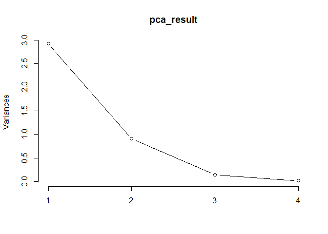
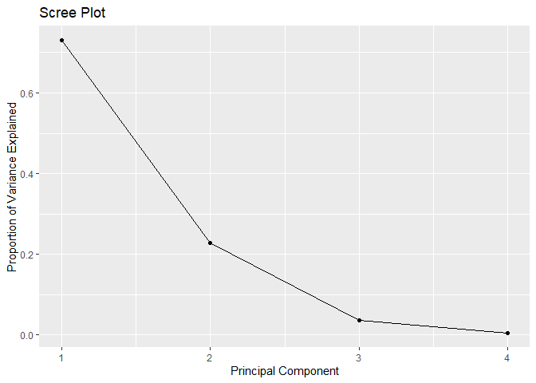
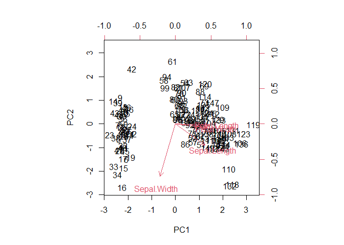
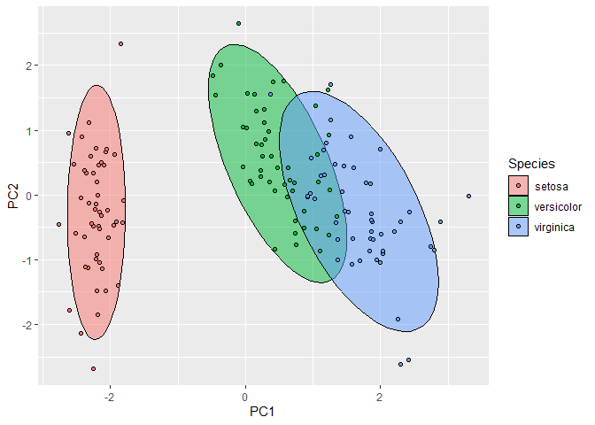

Principal Component Analysis using R
================
Joshua Edefo
2024-07-27

library

``` r
library(ggplot2)
```

    ## Warning: package 'ggplot2' was built under R version 4.3.2

Load the iris dataset

``` r
data(iris)
head(iris)
```

    ##   Sepal.Length Sepal.Width Petal.Length Petal.Width Species
    ## 1          5.1         3.5          1.4         0.2  setosa
    ## 2          4.9         3.0          1.4         0.2  setosa
    ## 3          4.7         3.2          1.3         0.2  setosa
    ## 4          4.6         3.1          1.5         0.2  setosa
    ## 5          5.0         3.6          1.4         0.2  setosa
    ## 6          5.4         3.9          1.7         0.4  setosa

``` r
str(iris)
```

    ## 'data.frame':    150 obs. of  5 variables:
    ##  $ Sepal.Length: num  5.1 4.9 4.7 4.6 5 5.4 4.6 5 4.4 4.9 ...
    ##  $ Sepal.Width : num  3.5 3 3.2 3.1 3.6 3.9 3.4 3.4 2.9 3.1 ...
    ##  $ Petal.Length: num  1.4 1.4 1.3 1.5 1.4 1.7 1.4 1.5 1.4 1.5 ...
    ##  $ Petal.Width : num  0.2 0.2 0.2 0.2 0.2 0.4 0.3 0.2 0.2 0.1 ...
    ##  $ Species     : Factor w/ 3 levels "setosa","versicolor",..: 1 1 1 1 1 1 1 1 1 1 ...

``` r
summary (iris)
```

    ##   Sepal.Length    Sepal.Width     Petal.Length    Petal.Width   
    ##  Min.   :4.300   Min.   :2.000   Min.   :1.000   Min.   :0.100  
    ##  1st Qu.:5.100   1st Qu.:2.800   1st Qu.:1.600   1st Qu.:0.300  
    ##  Median :5.800   Median :3.000   Median :4.350   Median :1.300  
    ##  Mean   :5.843   Mean   :3.057   Mean   :3.758   Mean   :1.199  
    ##  3rd Qu.:6.400   3rd Qu.:3.300   3rd Qu.:5.100   3rd Qu.:1.800  
    ##  Max.   :7.900   Max.   :4.400   Max.   :6.900   Max.   :2.500  
    ##        Species  
    ##  setosa    :50  
    ##  versicolor:50  
    ##  virginica :50  
    ##                 
    ##                 
    ## 

Exclude the species column as it’s a categorical variable

``` r
iris_data <- iris[, 1:4] # or iris_data <- iris[, -5] or iris_data <- iris (~Sepal.Length + Sepal.Length + Petal.Length + Petal.Width, data = iris )
iris_data
```

    ##     Sepal.Length Sepal.Width Petal.Length Petal.Width
    ## 1            5.1         3.5          1.4         0.2
    ## 2            4.9         3.0          1.4         0.2
    ## 3            4.7         3.2          1.3         0.2
    ## 4            4.6         3.1          1.5         0.2
    ## 5            5.0         3.6          1.4         0.2
    ## 6            5.4         3.9          1.7         0.4
    ## 7            4.6         3.4          1.4         0.3
    ## 8            5.0         3.4          1.5         0.2
    ## 9            4.4         2.9          1.4         0.2
    ## 10           4.9         3.1          1.5         0.1
    ## 11           5.4         3.7          1.5         0.2
    ## 12           4.8         3.4          1.6         0.2
    ## 13           4.8         3.0          1.4         0.1
    ## 14           4.3         3.0          1.1         0.1
    ## 15           5.8         4.0          1.2         0.2
    ## 16           5.7         4.4          1.5         0.4
    ## 17           5.4         3.9          1.3         0.4
    ## 18           5.1         3.5          1.4         0.3
    ## 19           5.7         3.8          1.7         0.3
    ## 20           5.1         3.8          1.5         0.3
    ## 21           5.4         3.4          1.7         0.2
    ## 22           5.1         3.7          1.5         0.4
    ## 23           4.6         3.6          1.0         0.2
    ## 24           5.1         3.3          1.7         0.5
    ## 25           4.8         3.4          1.9         0.2
    ## 26           5.0         3.0          1.6         0.2
    ## 27           5.0         3.4          1.6         0.4
    ## 28           5.2         3.5          1.5         0.2
    ## 29           5.2         3.4          1.4         0.2
    ## 30           4.7         3.2          1.6         0.2
    ## 31           4.8         3.1          1.6         0.2
    ## 32           5.4         3.4          1.5         0.4
    ## 33           5.2         4.1          1.5         0.1
    ## 34           5.5         4.2          1.4         0.2
    ## 35           4.9         3.1          1.5         0.2
    ## 36           5.0         3.2          1.2         0.2
    ## 37           5.5         3.5          1.3         0.2
    ## 38           4.9         3.6          1.4         0.1
    ## 39           4.4         3.0          1.3         0.2
    ## 40           5.1         3.4          1.5         0.2
    ## 41           5.0         3.5          1.3         0.3
    ## 42           4.5         2.3          1.3         0.3
    ## 43           4.4         3.2          1.3         0.2
    ## 44           5.0         3.5          1.6         0.6
    ## 45           5.1         3.8          1.9         0.4
    ## 46           4.8         3.0          1.4         0.3
    ## 47           5.1         3.8          1.6         0.2
    ## 48           4.6         3.2          1.4         0.2
    ## 49           5.3         3.7          1.5         0.2
    ## 50           5.0         3.3          1.4         0.2
    ## 51           7.0         3.2          4.7         1.4
    ## 52           6.4         3.2          4.5         1.5
    ## 53           6.9         3.1          4.9         1.5
    ## 54           5.5         2.3          4.0         1.3
    ## 55           6.5         2.8          4.6         1.5
    ## 56           5.7         2.8          4.5         1.3
    ## 57           6.3         3.3          4.7         1.6
    ## 58           4.9         2.4          3.3         1.0
    ## 59           6.6         2.9          4.6         1.3
    ## 60           5.2         2.7          3.9         1.4
    ## 61           5.0         2.0          3.5         1.0
    ## 62           5.9         3.0          4.2         1.5
    ## 63           6.0         2.2          4.0         1.0
    ## 64           6.1         2.9          4.7         1.4
    ## 65           5.6         2.9          3.6         1.3
    ## 66           6.7         3.1          4.4         1.4
    ## 67           5.6         3.0          4.5         1.5
    ## 68           5.8         2.7          4.1         1.0
    ## 69           6.2         2.2          4.5         1.5
    ## 70           5.6         2.5          3.9         1.1
    ## 71           5.9         3.2          4.8         1.8
    ## 72           6.1         2.8          4.0         1.3
    ## 73           6.3         2.5          4.9         1.5
    ## 74           6.1         2.8          4.7         1.2
    ## 75           6.4         2.9          4.3         1.3
    ## 76           6.6         3.0          4.4         1.4
    ## 77           6.8         2.8          4.8         1.4
    ## 78           6.7         3.0          5.0         1.7
    ## 79           6.0         2.9          4.5         1.5
    ## 80           5.7         2.6          3.5         1.0
    ## 81           5.5         2.4          3.8         1.1
    ## 82           5.5         2.4          3.7         1.0
    ## 83           5.8         2.7          3.9         1.2
    ## 84           6.0         2.7          5.1         1.6
    ## 85           5.4         3.0          4.5         1.5
    ## 86           6.0         3.4          4.5         1.6
    ## 87           6.7         3.1          4.7         1.5
    ## 88           6.3         2.3          4.4         1.3
    ## 89           5.6         3.0          4.1         1.3
    ## 90           5.5         2.5          4.0         1.3
    ## 91           5.5         2.6          4.4         1.2
    ## 92           6.1         3.0          4.6         1.4
    ## 93           5.8         2.6          4.0         1.2
    ## 94           5.0         2.3          3.3         1.0
    ## 95           5.6         2.7          4.2         1.3
    ## 96           5.7         3.0          4.2         1.2
    ## 97           5.7         2.9          4.2         1.3
    ## 98           6.2         2.9          4.3         1.3
    ## 99           5.1         2.5          3.0         1.1
    ## 100          5.7         2.8          4.1         1.3
    ## 101          6.3         3.3          6.0         2.5
    ## 102          5.8         2.7          5.1         1.9
    ## 103          7.1         3.0          5.9         2.1
    ## 104          6.3         2.9          5.6         1.8
    ## 105          6.5         3.0          5.8         2.2
    ## 106          7.6         3.0          6.6         2.1
    ## 107          4.9         2.5          4.5         1.7
    ## 108          7.3         2.9          6.3         1.8
    ## 109          6.7         2.5          5.8         1.8
    ## 110          7.2         3.6          6.1         2.5
    ## 111          6.5         3.2          5.1         2.0
    ## 112          6.4         2.7          5.3         1.9
    ## 113          6.8         3.0          5.5         2.1
    ## 114          5.7         2.5          5.0         2.0
    ## 115          5.8         2.8          5.1         2.4
    ## 116          6.4         3.2          5.3         2.3
    ## 117          6.5         3.0          5.5         1.8
    ## 118          7.7         3.8          6.7         2.2
    ## 119          7.7         2.6          6.9         2.3
    ## 120          6.0         2.2          5.0         1.5
    ## 121          6.9         3.2          5.7         2.3
    ## 122          5.6         2.8          4.9         2.0
    ## 123          7.7         2.8          6.7         2.0
    ## 124          6.3         2.7          4.9         1.8
    ## 125          6.7         3.3          5.7         2.1
    ## 126          7.2         3.2          6.0         1.8
    ## 127          6.2         2.8          4.8         1.8
    ## 128          6.1         3.0          4.9         1.8
    ## 129          6.4         2.8          5.6         2.1
    ## 130          7.2         3.0          5.8         1.6
    ## 131          7.4         2.8          6.1         1.9
    ## 132          7.9         3.8          6.4         2.0
    ## 133          6.4         2.8          5.6         2.2
    ## 134          6.3         2.8          5.1         1.5
    ## 135          6.1         2.6          5.6         1.4
    ## 136          7.7         3.0          6.1         2.3
    ## 137          6.3         3.4          5.6         2.4
    ## 138          6.4         3.1          5.5         1.8
    ## 139          6.0         3.0          4.8         1.8
    ## 140          6.9         3.1          5.4         2.1
    ## 141          6.7         3.1          5.6         2.4
    ## 142          6.9         3.1          5.1         2.3
    ## 143          5.8         2.7          5.1         1.9
    ## 144          6.8         3.2          5.9         2.3
    ## 145          6.7         3.3          5.7         2.5
    ## 146          6.7         3.0          5.2         2.3
    ## 147          6.3         2.5          5.0         1.9
    ## 148          6.5         3.0          5.2         2.0
    ## 149          6.2         3.4          5.4         2.3
    ## 150          5.9         3.0          5.1         1.8

Standardised the scale

``` r
iris_scaled <- scale(iris_data)
```

Perform PCA, & view eigen values and vectors

``` r
pca_result <- prcomp(iris_scaled, center = TRUE, scale. = TRUE)
pca_result
```

    ## Standard deviations (1, .., p=4):
    ## [1] 1.7083611 0.9560494 0.3830886 0.1439265
    ## 
    ## Rotation (n x k) = (4 x 4):
    ##                     PC1         PC2        PC3        PC4
    ## Sepal.Length  0.5210659 -0.37741762  0.7195664  0.2612863
    ## Sepal.Width  -0.2693474 -0.92329566 -0.2443818 -0.1235096
    ## Petal.Length  0.5804131 -0.02449161 -0.1421264 -0.8014492
    ## Petal.Width   0.5648565 -0.06694199 -0.6342727  0.5235971

plot showing the variance \$ visualize the explained variance (scree
plot)

``` r
plot(pca_result, type = "l")
```

<!-- -->

``` r
scree_plot <- qplot(1:length(pca_result$sdev), 
                    (pca_result$sdev)^2 / sum((pca_result$sdev)^2), 
                    geom = "line") +
  geom_point() +
  labs(x = "Principal Component", 
       y = "Proportion of Variance Explained",
       title = "Scree Plot")
```

    ## Warning: `qplot()` was deprecated in ggplot2 3.4.0.
    ## This warning is displayed once every 8 hours.
    ## Call `lifecycle::last_lifecycle_warnings()` to see where this warning was
    ## generated.

``` r
print(scree_plot)
```

<!-- -->

Visualize the PCA results (biplot), extract PC scores & extract and view
the principal components

``` r
biplot(pca_result, scale = 0)
```

<!-- -->

``` r
str(pca_result)
```

    ## List of 5
    ##  $ sdev    : num [1:4] 1.708 0.956 0.383 0.144
    ##  $ rotation: num [1:4, 1:4] 0.521 -0.269 0.58 0.565 -0.377 ...
    ##   ..- attr(*, "dimnames")=List of 2
    ##   .. ..$ : chr [1:4] "Sepal.Length" "Sepal.Width" "Petal.Length" "Petal.Width"
    ##   .. ..$ : chr [1:4] "PC1" "PC2" "PC3" "PC4"
    ##  $ center  : Named num [1:4] -4.48e-16 2.04e-16 -2.84e-17 -3.71e-17
    ##   ..- attr(*, "names")= chr [1:4] "Sepal.Length" "Sepal.Width" "Petal.Length" "Petal.Width"
    ##  $ scale   : Named num [1:4] 1 1 1 1
    ##   ..- attr(*, "names")= chr [1:4] "Sepal.Length" "Sepal.Width" "Petal.Length" "Petal.Width"
    ##  $ x       : num [1:150, 1:4] -2.26 -2.07 -2.36 -2.29 -2.38 ...
    ##   ..- attr(*, "dimnames")=List of 2
    ##   .. ..$ : NULL
    ##   .. ..$ : chr [1:4] "PC1" "PC2" "PC3" "PC4"
    ##  - attr(*, "class")= chr "prcomp"

``` r
pca_result$x
```

    ##                PC1          PC2          PC3          PC4
    ##   [1,] -2.25714118 -0.478423832  0.127279624  0.024087508
    ##   [2,] -2.07401302  0.671882687  0.233825517  0.102662845
    ##   [3,] -2.35633511  0.340766425 -0.044053900  0.028282305
    ##   [4,] -2.29170679  0.595399863 -0.090985297 -0.065735340
    ##   [5,] -2.38186270 -0.644675659 -0.015685647 -0.035802870
    ##   [6,] -2.06870061 -1.484205297 -0.026878250  0.006586116
    ##   [7,] -2.43586845 -0.047485118 -0.334350297 -0.036652767
    ##   [8,] -2.22539189 -0.222403002  0.088399352 -0.024529919
    ##   [9,] -2.32684533  1.111603700 -0.144592465 -0.026769540
    ##  [10,] -2.17703491  0.467447569  0.252918268 -0.039766068
    ##  [11,] -2.15907699 -1.040205867  0.267784001  0.016675503
    ##  [12,] -2.31836413 -0.132633999 -0.093446191 -0.133037725
    ##  [13,] -2.21104370  0.726243183  0.230140246  0.002416941
    ##  [14,] -2.62430902  0.958296347 -0.180192423 -0.019151375
    ##  [15,] -2.19139921 -1.853846555  0.471322025  0.194081578
    ##  [16,] -2.25466121 -2.677315230 -0.030424684  0.050365010
    ##  [17,] -2.20021676 -1.478655729  0.005326251  0.188186988
    ##  [18,] -2.18303613 -0.487206131  0.044067686  0.092779618
    ##  [19,] -1.89223284 -1.400327567  0.373093377  0.060891973
    ##  [20,] -2.33554476 -1.124083597 -0.132187626 -0.037630354
    ##  [21,] -1.90793125 -0.407490576  0.419885937  0.010884821
    ##  [22,] -2.19964383 -0.921035871 -0.159331502  0.059398340
    ##  [23,] -2.76508142 -0.456813301 -0.331069982  0.019582826
    ##  [24,] -1.81259716 -0.085272854 -0.034373442  0.150636353
    ##  [25,] -2.21972701 -0.136796175 -0.117599566 -0.269238379
    ##  [26,] -1.94532930  0.623529705  0.304620475  0.043416203
    ##  [27,] -2.04430277 -0.241354991 -0.086075649  0.067454082
    ##  [28,] -2.16133650 -0.525389422  0.206125707  0.010241084
    ##  [29,] -2.13241965 -0.312172005  0.270244895  0.083977887
    ##  [30,] -2.25769799  0.336604248 -0.068207276 -0.107918349
    ##  [31,] -2.13297647  0.502856075  0.074757996 -0.048027970
    ##  [32,] -1.82547925 -0.422280389  0.269564311  0.239069476
    ##  [33,] -2.60621687 -1.787587272 -0.047070727 -0.228470534
    ##  [34,] -2.43800983 -2.143546796  0.082392024 -0.048053409
    ##  [35,] -2.10292986  0.458665270  0.169706329  0.028926042
    ##  [36,] -2.20043723  0.205419224  0.224688852  0.168343905
    ##  [37,] -2.03831765 -0.659349230  0.482919584  0.195702902
    ##  [38,] -2.51889339 -0.590315163 -0.019370918 -0.136048774
    ##  [39,] -2.42152026  0.901161067 -0.192609402 -0.009705907
    ##  [40,] -2.16246625 -0.267981199  0.175296561  0.007023875
    ##  [41,] -2.27884081 -0.440240541 -0.034778398  0.106626042
    ##  [42,] -1.85191836  2.329610745  0.203552303  0.288896090
    ##  [43,] -2.54511203  0.477501017 -0.304745527 -0.066379077
    ##  [44,] -1.95788857 -0.470749613 -0.308567588  0.176501717
    ##  [45,] -2.12992356 -1.138415464 -0.247604064 -0.150539117
    ##  [46,] -2.06283361  0.708678586  0.063716370  0.139801160
    ##  [47,] -2.37677076 -1.116688691 -0.057026813 -0.151722682
    ##  [48,] -2.38638171  0.384957230 -0.139002234 -0.048671707
    ##  [49,] -2.22200263 -0.994627669  0.180886792 -0.014878291
    ##  [50,] -2.19647504 -0.009185585  0.152518539  0.049206884
    ##  [51,]  1.09810244 -0.860091033  0.682300393  0.034717469
    ##  [52,]  0.72889556 -0.592629362  0.093807452  0.004887251
    ##  [53,]  1.23683580 -0.614239894  0.552157058  0.009391933
    ##  [54,]  0.40612251  1.748546197  0.023024633  0.065549239
    ##  [55,]  1.07188379  0.207725147  0.396925784  0.104387166
    ##  [56,]  0.38738955  0.591302717 -0.123776885 -0.240027187
    ##  [57,]  0.74403715 -0.770438272 -0.148472007 -0.077111455
    ##  [58,] -0.48569562  1.846243998 -0.248432992 -0.040384912
    ##  [59,]  0.92480346 -0.032118478  0.594178807 -0.029779844
    ##  [60,]  0.01138804  1.030565784 -0.537100055 -0.028366154
    ##  [61,] -0.10982834  2.645211115  0.046634215  0.013714785
    ##  [62,]  0.43922201  0.063083852 -0.204389093  0.039992104
    ##  [63,]  0.56023148  1.758832129  0.763214554  0.045578465
    ##  [64,]  0.71715934  0.185602819  0.068429700 -0.164256922
    ##  [65,] -0.03324333  0.437537419 -0.194282030  0.108684396
    ##  [66,]  0.87248429 -0.507364239  0.501830204  0.104593326
    ##  [67,]  0.34908221  0.195656268 -0.489234095 -0.190869932
    ##  [68,]  0.15827980  0.789451008  0.301028700 -0.204612265
    ##  [69,]  1.22100316  1.616827281  0.480693656  0.225145511
    ##  [70,]  0.16436725  1.298259939  0.172260719 -0.051554138
    ##  [71,]  0.73521959 -0.395247446 -0.614467782 -0.083006045
    ##  [72,]  0.47469691  0.415926887  0.264067576  0.113189079
    ##  [73,]  1.23005729  0.930209441  0.367182178 -0.009911322
    ##  [74,]  0.63074514  0.414997441  0.290921638 -0.273304557
    ##  [75,]  0.70031506  0.063200094  0.444537765  0.043313222
    ##  [76,]  0.87135454 -0.249956017  0.471001057  0.101376117
    ##  [77,]  1.25231375  0.076998069  0.724727099  0.039556002
    ##  [78,]  1.35386953 -0.330205463  0.259955701  0.066604931
    ##  [79,]  0.66258066  0.225173502 -0.085577197 -0.036318171
    ##  [80,] -0.04012419  1.055183583  0.318506304  0.064571834
    ##  [81,]  0.13035846  1.557055553  0.149482697 -0.009371129
    ##  [82,]  0.02337438  1.567225244  0.240745761 -0.032663020
    ##  [83,]  0.24073180  0.774661195  0.150707074  0.023572390
    ##  [84,]  1.05755171  0.631726901 -0.104959762 -0.183354200
    ##  [85,]  0.22323093  0.286812663 -0.663028512 -0.253977520
    ##  [86,]  0.42770626 -0.842758920 -0.449129446 -0.109308985
    ##  [87,]  1.04522645 -0.520308714  0.394464890  0.037084781
    ##  [88,]  1.04104379  1.378371048  0.685997804  0.136378719
    ##  [89,]  0.06935597  0.218770433 -0.290605718 -0.146653279
    ##  [90,]  0.28253073  1.324886147 -0.089111491  0.008876070
    ##  [91,]  0.27814596  1.116288852 -0.094172116 -0.269753497
    ##  [92,]  0.62248441 -0.024839814  0.020412763 -0.147193289
    ##  [93,]  0.33540673  0.985103828  0.198724011  0.006508757
    ##  [94,] -0.36097409  2.012495825 -0.105467721  0.019505467
    ##  [95,]  0.28762268  0.852873116 -0.130452657 -0.107043742
    ##  [96,]  0.09105561  0.180587142 -0.128547696 -0.229191812
    ##  [97,]  0.22695654  0.383634868 -0.155691572 -0.132163118
    ##  [98,]  0.57446378  0.154356489  0.270743347 -0.019794366
    ##  [99,] -0.44617230  1.538637456 -0.189765199  0.199278855
    ## [100,]  0.25587339  0.596852285 -0.091572385 -0.058426315
    ## [101,]  1.83841002 -0.867515056 -1.002044077 -0.049085303
    ## [102,]  1.15401555  0.696536401 -0.528389994 -0.040385459
    ## [103,]  2.19790361 -0.560133976  0.202236658  0.058986583
    ## [104,]  1.43534213  0.046830701 -0.163083761 -0.234982858
    ## [105,]  1.86157577 -0.294059697 -0.394307408 -0.016243853
    ## [106,]  2.74268509 -0.797736709  0.580364827 -0.101045973
    ## [107,]  0.36579225  1.556289178 -0.983598122 -0.132679346
    ## [108,]  2.29475181 -0.418663020  0.649530452 -0.237246445
    ## [109,]  1.99998633  0.709063226  0.392675073 -0.086221779
    ## [110,]  2.25223216 -1.914596301 -0.396224508  0.104488870
    ## [111,]  1.35962064 -0.690443405 -0.283661780  0.107500284
    ## [112,]  1.59732747  0.420292431 -0.023108991  0.058136869
    ## [113,]  1.87761053 -0.417849815 -0.026250468  0.145926073
    ## [114,]  1.25590769  1.158379741 -0.578311891  0.098826244
    ## [115,]  1.46274487  0.440794883 -1.000517746  0.274738504
    ## [116,]  1.58476820 -0.673986887 -0.636297054  0.191222383
    ## [117,]  1.46651849 -0.254768327 -0.037306280 -0.154811637
    ## [118,]  2.41822770 -2.548124795  0.127454475 -0.272892966
    ## [119,]  3.29964148 -0.017721580  0.700957033  0.045037725
    ## [120,]  1.25954707  1.701046715  0.266643612 -0.064963167
    ## [121,]  2.03091256 -0.907427443 -0.234015510  0.167390481
    ## [122,]  0.97471535  0.569855257 -0.825362161  0.027662914
    ## [123,]  2.88797650 -0.412259950  0.854558973 -0.126911337
    ## [124,]  1.32878064  0.480202496  0.005410239  0.139491837
    ## [125,]  1.69505530 -1.010536476 -0.297454114 -0.061437911
    ## [126,]  1.94780139 -1.004412720  0.418582432 -0.217609339
    ## [127,]  1.17118007  0.315338060 -0.129503907  0.125001677
    ## [128,]  1.01754169 -0.064131184 -0.336588365 -0.008625505
    ## [129,]  1.78237879  0.186735633 -0.269754304  0.030983849
    ## [130,]  1.85742501 -0.560413289  0.713244682 -0.207519953
    ## [131,]  2.42782030 -0.258418706  0.725386035 -0.017863520
    ## [132,]  2.29723178 -2.617554417  0.491826144 -0.210968943
    ## [133,]  1.85648383  0.177953334 -0.352966242  0.099675959
    ## [134,]  1.11042770  0.291944582  0.182875741 -0.185721512
    ## [135,]  1.19845835  0.808606364  0.164173760 -0.487849130
    ## [136,]  2.78942561 -0.853942542  0.541093785  0.294893130
    ## [137,]  1.57099294 -1.065013214 -0.942695700  0.035486875
    ## [138,]  1.34179696 -0.421020154 -0.180271551 -0.214702016
    ## [139,]  0.92173701 -0.017165594 -0.415434449  0.005220919
    ## [140,]  1.84586124 -0.673870645  0.012629804  0.194543500
    ## [141,]  2.00808316 -0.611835930 -0.426902678  0.246711805
    ## [142,]  1.89543421 -0.687273065 -0.129640697  0.468128374
    ## [143,]  1.15401555  0.696536401 -0.528389994 -0.040385459
    ## [144,]  2.03374499 -0.864624030 -0.337014969  0.045036251
    ## [145,]  1.99147547 -1.045665670 -0.630301866  0.213330527
    ## [146,]  1.86425786 -0.385674038 -0.255418178  0.387957152
    ## [147,]  1.55935649  0.893692855  0.026283300  0.219456899
    ## [148,]  1.51609145 -0.268170747 -0.179576781  0.118773236
    ## [149,]  1.36820418 -1.007877934 -0.930278721  0.026041407
    ## [150,]  0.95744849  0.024250427 -0.526485033 -0.162533529

Take PC scores of PCI and PC2 and attached to iris data

``` r
iris2 <- cbind (iris,pca_result$x [, 1:2])
head(iris2)
```

    ##   Sepal.Length Sepal.Width Petal.Length Petal.Width Species       PC1
    ## 1          5.1         3.5          1.4         0.2  setosa -2.257141
    ## 2          4.9         3.0          1.4         0.2  setosa -2.074013
    ## 3          4.7         3.2          1.3         0.2  setosa -2.356335
    ## 4          4.6         3.1          1.5         0.2  setosa -2.291707
    ## 5          5.0         3.6          1.4         0.2  setosa -2.381863
    ## 6          5.4         3.9          1.7         0.4  setosa -2.068701
    ##          PC2
    ## 1 -0.4784238
    ## 2  0.6718827
    ## 3  0.3407664
    ## 4  0.5953999
    ## 5 -0.6446757
    ## 6 -1.4842053

``` r
str (iris2)
```

    ## 'data.frame':    150 obs. of  7 variables:
    ##  $ Sepal.Length: num  5.1 4.9 4.7 4.6 5 5.4 4.6 5 4.4 4.9 ...
    ##  $ Sepal.Width : num  3.5 3 3.2 3.1 3.6 3.9 3.4 3.4 2.9 3.1 ...
    ##  $ Petal.Length: num  1.4 1.4 1.3 1.5 1.4 1.7 1.4 1.5 1.4 1.5 ...
    ##  $ Petal.Width : num  0.2 0.2 0.2 0.2 0.2 0.4 0.3 0.2 0.2 0.1 ...
    ##  $ Species     : Factor w/ 3 levels "setosa","versicolor",..: 1 1 1 1 1 1 1 1 1 1 ...
    ##  $ PC1         : num  -2.26 -2.07 -2.36 -2.29 -2.38 ...
    ##  $ PC2         : num  -0.478 0.672 0.341 0.595 -0.645 ...

Plot with ggplot

``` r
ggplot(iris2, aes(PC1, PC2, col = Species, fill = Species)) + 
  stat_ellipse(geom = "polygon", col = "black", alpha = 0.5) + 
  geom_point(shape = 21, col = "black") 
```

<!-- -->

Correlations between variables and Principal Component Scores

``` r
cor (iris[, -5])
```

    ##              Sepal.Length Sepal.Width Petal.Length Petal.Width
    ## Sepal.Length    1.0000000  -0.1175698    0.8717538   0.8179411
    ## Sepal.Width    -0.1175698   1.0000000   -0.4284401  -0.3661259
    ## Petal.Length    0.8717538  -0.4284401    1.0000000   0.9628654
    ## Petal.Width     0.8179411  -0.3661259    0.9628654   1.0000000

``` r
cor (iris[, -5], iris2 [, 6:7] )
```

    ##                     PC1         PC2
    ## Sepal.Length  0.8901688 -0.36082989
    ## Sepal.Width  -0.4601427 -0.88271627
    ## Petal.Length  0.9915552 -0.02341519
    ## Petal.Width   0.9649790 -0.06399985

session information

``` r
sessionInfo()
```

    ## R version 4.3.1 (2023-06-16 ucrt)
    ## Platform: x86_64-w64-mingw32/x64 (64-bit)
    ## Running under: Windows 11 x64 (build 22631)
    ## 
    ## Matrix products: default
    ## 
    ## 
    ## locale:
    ## [1] LC_COLLATE=English_United Kingdom.utf8 
    ## [2] LC_CTYPE=English_United Kingdom.utf8   
    ## [3] LC_MONETARY=English_United Kingdom.utf8
    ## [4] LC_NUMERIC=C                           
    ## [5] LC_TIME=English_United Kingdom.utf8    
    ## 
    ## time zone: Europe/London
    ## tzcode source: internal
    ## 
    ## attached base packages:
    ## [1] stats     graphics  grDevices utils     datasets  methods   base     
    ## 
    ## other attached packages:
    ## [1] ggplot2_3.4.4
    ## 
    ## loaded via a namespace (and not attached):
    ##  [1] crayon_1.5.2      vctrs_0.6.3       cli_3.6.1         knitr_1.44       
    ##  [5] rlang_1.1.1       xfun_0.40         generics_0.1.3    labeling_0.4.3   
    ##  [9] glue_1.6.2        colorspace_2.1-0  htmltools_0.5.6   scales_1.3.0     
    ## [13] fansi_1.0.4       rmarkdown_2.25    grid_4.3.1        evaluate_0.21    
    ## [17] munsell_0.5.0     tibble_3.2.1      MASS_7.3-60       fastmap_1.1.1    
    ## [21] yaml_2.3.7        lifecycle_1.0.3   compiler_4.3.1    dplyr_1.1.3      
    ## [25] pkgconfig_2.0.3   rstudioapi_0.15.0 farver_2.1.1      digest_0.6.33    
    ## [29] R6_2.5.1          tidyselect_1.2.0  utf8_1.2.3        pillar_1.9.0     
    ## [33] magrittr_2.0.3    withr_2.5.0       tools_4.3.1       gtable_0.3.4
